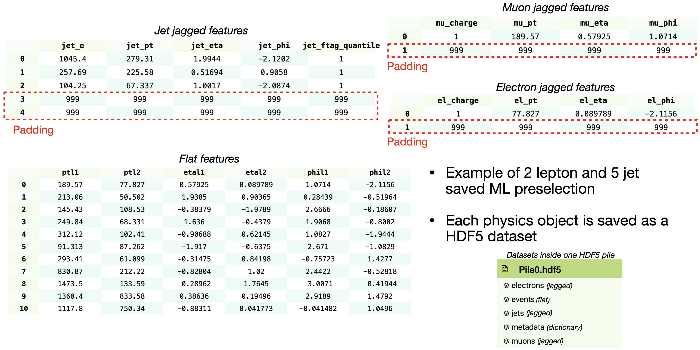

HDF5 conversion configuration options are defined in the `convert_config.yaml` file located in the `signal/` and `fakes/` directories under the `convert_config` field.

!!! Note
    HDF5 converter is designed to work with TNAnalysis preselection ROOT files. Ensure that the input files are in the correct format before using the converter. If your files come from a different source, you may need to preprocess them to match the expected structure.

!!! Tip
    Custom HDF5 dataset can be easily created using the [`F9Columnar`](https://gitlab.cern.ch/ijs-f9-ljubljana/F9Columnar) library. This allows anyone to create custom HDF5 datasets from any ROOT files by writing some Python code. An example for ATLAS Open Data can be found [here](https://gitlab.cern.ch/atlas-dch-seesaw-analyses/SeeSawML/-/blob/main/seesaw/fakes/dataset/hdf5_opendata_converter.py?ref_type=heads). For more details, refer to the F9Columnar README.


## Dataset Configuration

Dataset configurations are imported from the `hdf5_config/` directory into the `convert_config.yaml` files.

### Signal Dataset Configuration

- `signal_label: str`: Label used to identify signal events in the dataset in the case of binary classification.
- `labels: list[str]`: List of all class labels in the dataset for multi-class classification.
- `flat: dict[str, list[str]]`: Configuration for flat features.
    - `extra_input: list[str]`: Additional flat features to be used as input, but not as output.
    - `output: list[str]`: Flat features to be used as output.
    - `extra_output: list[str]`: Additional flat features to be stored in the dataset that are not in the input files.
- `jagged: dict[str, dict[str, list[str] | int | float]]`: Configuration for jagged features.
    - `<object_name>: str`: Name of the jagged object (e.g., jets, electrons).
        - `output: list[str]`: List of jagged features to be used as output.
        - `extra_input: list[str]`: Additional jagged features to be used as input, but not as output.
        - `max_length: int`: Maximum length to truncate the jagged array at.
        - `pad_value: float`: Value used to pad the jagged array to the maximum length.
- `enforce_types: dict[str, str]`: Dictionary specifying the data types to enforce for certain features.
- `scale: dict[str, float]`: Dictionary specifying scaling factors features. Useful for unti conversion (e.g., MeV to GeV).
- `custom_chunk_shapes: dict[str, int]`: Custom chunk shapes for different labels to optimize HDF5 storage.

!!! Example
    Two lepton signal vs background dataset configuration example:
    ```yaml
    labels:
      - typeIIseesaw_fast_1000
      - typeIIseesaw_fast_1100
      - typeIIseesaw_fast_1200
      - typeIIseesaw_fast_1300
      - typeIIseesaw_fast_1400
      - typeIIseesaw_fast_1500
      - ttbar_inclusive
      - singletop_inclusive
      - raretop
      - ttH
      - ttW
      - ttZ
      - Zjets
      - Wjets
      - dijet
      - diboson
      - data
    flat:
      extra_input:
        - eventWeight
      output:
        - ptl1
        - ptl2
        - etal1
        - etal2
        - phil1
        - phil2
        - mll
        - njets
        - nwhbosons
        - mlmass
      extra_output:
        - weights
        - sig_type
        - label_type
    jagged:
      jets:
        output:
          - jet_e
          - jet_pt
          - jet_eta
          - jet_phi
          - jet_ftag_quantile
        max_length: 5
        pad_value: 999.0
      electrons:
        output:
          - el_charge
          - el_pt
          - el_eta
          - el_phi
        extra_input:
          - el_type
        max_length: 2
        pad_value: 999.0
      muons:
        output:
          - mu_charge
          - mu_pt
          - mu_eta
          - mu_phi
        extra_input:
          - mu_type
        max_length: 2
        pad_value: 999.0
    enforce_types:
      njets: int64
      nwhbosons: int64
      el_charge: int64
      mu_charge: int64
    scale:
      jet_e: 1e-3
      jet_pt: 1e-3
      el_pt: 1e-3
      mu_pt: 1e-3
    custom_chunk_shapes:
      typeIIseesaw_1000: 32
      typeIIseesaw_1100: 32
      typeIIseesaw_1200: 32
      typeIIseesaw_1300: 32
      typeIIseesaw_1400: 32
      typeIIseesaw_1500: 32
    ```

    HDF5 file structure created from the above configuration:

    


!!! Tip
    You can inspect created HDF5 files online using [myHDF5viewer](https://myhdf5.hdfgroup.org/help).


### Fakes Dataset Configuration

- `particle_type: str`: Type of particle for the fakes dataset (e.g., electrons, muons).
- `data: list[str]`: List of data features to be used.
- `mc: list[str]`: List of MC features to be used.
- `output: list[str]`: List of features to be used as output.
- `enforce_types: dict[str, str]`: Dictionary specifying the data types to enforce for certain features.
- `scale: dict[str, float]`: Dictionary specifying scaling factors features. Useful for unti conversion (e.g., MeV to GeV).

## Converter Settings

- `ntuples_dir: str | None`: Directory containing input ROOT files. If set to `null`, the converter will look for ROOT files in `ANALYSIS_ML_NTUPLES_DIR`.
- `key: str`: Directory key in the ROOT files to read branches from.
- `output_dir: str | None`: Directory where to save the converted HDF5 files. If set to `null`, the converter will save files in `ANALYSIS_ML_DATA_DIR`.
- `max_files: int | None`: Maximum number of ROOT files to process at once. If set to `null`, all files will be processed. Option to limit memory usage (usually not needed).
- `step_size: int`: Number of events to process in each step at once when reading from a ROOT file.
- `num_workers: int`: Number of worker processes to use for parallel processing. Set to `-1` to use all available CPU cores.
- `n_piles: int`: Number of HDF5 piles to create. Data will be distributed evenly across these piles.
- `chunk_shape: int`: Number of events to be saved to each pile in one write operation.
- `multiprocessing_context: str`: Multiprocessing context to use. Options are `fork`, `spawn`, or `forkserver`. Default is `fork`. See [Python multiprocessing docs](https://docs.python.org/3/library/multiprocessing.html#contexts-and-start-methods) for more details.
- `pile_assignment: str`: Method to assign events to piles. Options are `random` (random assignment) or `deque` (round-robin assignment).

!!! Info
    Pile is a small HDF5 file that contains a subset of the entire dataset. Multiple piles are created to allow for efficient data loading and parallel processing during training. Each pile contains a shuffled portion of events from the original ROOT files.

### Signal Specific Settings

- `same_sign_leptons: bool`: Filters pairs of same sign leptons when set to `true`. Useful for analyses focusing on same-sign dilepton events.
- `disable_other_label: bool`: If set to `true`, will ignore input files that do not contain the specified `labels`. If `false`, will include all input files and assign the `other` label to events not matching the specified `labels`. By default, it is set to `false`.

!!! Example
    Same sign two lepton signal vs background dataset converter settings example:
    ```yaml
    convert_config:
      ntuples_dir: null
      key: NOSYS/physics
      output_dir: null
      max_files: null
      step_size: 65536
      num_workers: -1
      n_piles: 512
      chunk_shape: 128
      multiprocessing_context: fork
      pile_assignment: random
      same_sign_leptons: true
    ```

### Fakes Specific Settings

- `output_file: str`: Name of the output HDF5 file if `merge_piles` is set to `true`.
- `merge_piles: bool`: If set to `true`, all created piles will be contained in a single HDF5 file instead of multiple piles.
- `njets_cut: list[int] | None`: Minimum and maximum number of jets to filter events.
- `met_cut: list[float] | None`: Minimum and maximum missing transverse energy to filter events.
- `mT_cut: list[float] | None`: Minimum and maximum transverse mass to filter events.
- `scale_wzjets: bool`: Whether to scale WZ+jets background events.
- `crack_veto: bool`: Whether to apply crack veto on electron eta.
