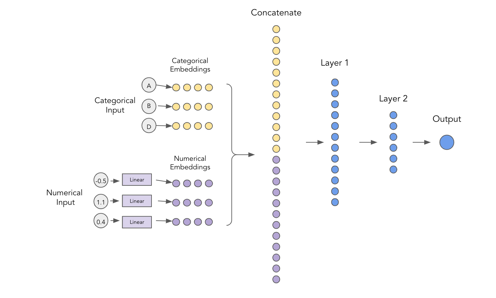
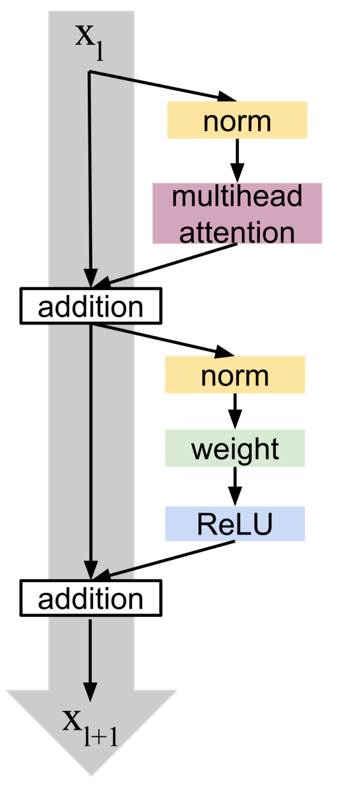
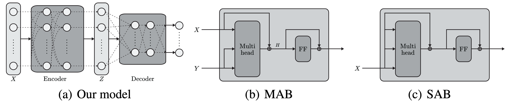

There are several model arhitectures available in the library. Each model may have its own specific configuration options. The configuration for each model type can be found in the `model_config/` directory. There are two top level YAML fields that are common to all models: `architecture_config` and `training_config`. The `architecture_config` field contains options specific to the model type, while the `training_config` field contains options related to the training process and is common across all models.

## Common Configuration

Besides the mentioned top level fields, there are some common configuration options that apply to all models and are specified at the top level of the model configuration file.

- `name: str`: Name of the model.
- `load_checkpoint: str | None`: Name of the checkpoint file to load the model weights from. If `null`, the model will be trained from scratch. Path to this checkpoint is configured in the `training_config.model_save_path`.
- `continue_training: bool`: Whether to continue training from the loaded checkpoint. If set to `true`, needs to be used in conjunction with `load_checkpoint`.

## Training Configuration

- `loss: dict[str | Any] | str`: Specifies the loss function to be used during training.
    - `loss_name: str`: The name of the loss function if `loss` is provided as a dictionary.
    - `loss_params: dict[str | Any]`: Parameters specific to the chosen loss function if `loss` is provided as a dictionary.

!!! Info
    Supported loss functions for signal vs background classification include:

    - `BCEWithLogitsLoss`: Binary classification loss with logits (**good baseline**).
    - `MSELoss`: Mean Squared Error loss for regression tasks.
    - `CrossEntropyLoss`: Standard cross-entropy loss for multi-class classification (**good baseline**).
    - `SigmoidFocalLoss`: Focal loss for addressing class imbalance in binary classification.
    - `MulticlassFocalLoss`: Focal loss for multi-class classification tasks.
    - All the losses from `pytorch_optimizer` package listed [here](https://pytorch-optimizers.readthedocs.io/en/latest/loss/).

    Supported loss functions for fakes estimation include different options, see [here](https://gitlab.cern.ch/atlas-dch-seesaw-analyses/SeeSawML/-/blob/main/seesaw/fakes/models/loss.py?ref_type=heads#L3).

- `disco: dict[str | Any] | None`: Distance correlation regularization to reduce mass sculpting from [https://arxiv.org/abs/2001.05310](https://arxiv.org/abs/2001.05310).
    - `variables: list[str]`: List of variable names to apply distance correlation regularization on.
    - `lambda: float`: Regularization strength.
    - `power: float`: Power to which the distance correlation is raised, by default `1.0`.
    - `weighted: bool`: Whether to use class or MC weights in the distance correlation calculation, by default `false`.
    - `multiclass_reduction: str`: Reduction method for multiclass distance correlation (`logits` or `entropy`), by default `logits`.

- `optimizer: dict[str | Any]`: Specifies the optimizer to be used during training.
    - `optimizer_name: str`: The name of the optimizer.
    - `optimizer_params: dict[str | Any]`: Parameters specific to the chosen optimizer.

!!! Info
    Supported optimizers include all optimizers from PyTorch listed [here](https://docs.pytorch.org/docs/stable/optim.html#algorithms) as well as those from `pytorch_optimizer` package listed [here](https://pytorch-optimizers.readthedocs.io/en/latest/optimizer/). A good default choice is `Adam` or `AdamW` with a learning rate of `3e-4`.

- `scheduler: dict[str | Any] | None`: Learning rate scheduler to adjust the learning rate during training.
    - `scheduler_name: str`: The name of the scheduler.
    - `interval: str`: Interval for scheduler step (`epoch` or `step`).
    - `scheduler_params: dict[str | Any]`: Parameters specific to the chosen scheduler.

!!! Info
    Supported schedulers include all schedulers from PyTorch listed [here](https://docs.pytorch.org/docs/stable/optim.html#how-to-adjust-learning-rate) as well as those from `pytorch_optimizer` package listed [here](https://pytorch-optimizers.readthedocs.io/en/latest/lr_scheduler/). Additionally, the following custom schedulers are available:

    - `AttentionWarmup`: Linear warmup followed by a decay.
    - `SqrtExpWarmup`: Combines square root decay with exponential warmup.
    - `CosineWarmup`: Cosine annealing with linear warmup.
    - `LinearWarmup`: Linear warmup followed by a constant learning rate.

- `reduce_lr_on_epoch: float | None`: If set, reduces the learning rate by a factor every epoch. Can be used as an alternative to schedulers.
- `max_epochs: int`: Maximum number of training epochs.
- `early_stop_patience: int | None`: Number of epochs with no improvement after which training will be stopped. If `null`, early stopping is disabled.
- `gradient_clip_val: float | None`: Maximum norm for gradient clipping. If `null`, gradient clipping is disabled.
- `monitor: str`: Metric to monitor for early stopping and learning rate scheduling, by default `val_loss`.
- `save_top_k: int`: Number of best models to save based on the monitored metric.
- `log_train_memory: bool`: Whether to log memory usage during training, by default `false`.
- `model_save_path: str | None`: Path where to save the model checkpoints. If `null`, defaults to `ANALYSIS_ML_MODELS_DIR/checkpoints`.

!!! Info
    Fakes models additionally support the following training configuration options:

    - `w_lambda: float`: Regularization strength for density estimation.
    - `ess_lambda: float`: Regularization strength for effective sample size.

!!! Example
    A simple binary classifier training configuration might look like this:

    ```yaml
    training_config:
      loss: bce

      optimizer:
        optimizer_name: Adam
        optimizer_params:
          lr: 1.0e-3
          weight_decay: 1.0e-5

      scheduler:
        scheduler_name: ReduceLROnPlateau
        interval: epoch
        scheduler_params:
          factor: 0.5
          patience: 5

      max_epochs: 100
      early_stop_patience: 10
      monitor: val_loss
      save_top_k: 5
      model_save_path: null
    ```

## Model Types

### Embeddings

In SeeSawML, embeddings are used to transform input physics variables into a higher-dimensional space, enabling the model to capture complex relationships within the data. There are two types of embeddings available: flat embeddings and jagged embeddings, each separated for continuous (numerical) and discrete (categorical) features. Categorical features are always embedded using a PyTorch `nn.Embedding` layer, while for numerical features there are three options:

1. Linear transformation of type `A*X + b` where `A` and `b` are learnable parameters.
2. Feature-wise linear transformation where each feature has its own linear layer.
3. Piecewise linear encoding (PLE) as described in [https://arxiv.org/abs/2203.05556](https://arxiv.org/abs/2203.05556), where mutliple binning schemes are possible: learnable, uniform, or quantile-based.

<figure markdown="span">
  { width="900" }
  <figcaption>Embeddings for a MLP model with both numerical and categorical features.</figcaption>
</figure>

Embeddings configuration is specified under the `architecture_config` and `architecture_config.embeddings` field in the model configuration file.

!!! Info
    Embeddings can be used with any model architecture in SeeSawML and they are part of the model. They are not limited to specific model types. They serve as a preprocessing step to transform input features before they are fed into the main model architecture. If `embedding_dim` is not specified explicitly, it defaults to the first hidden layer dimension of the model.

!!! Note
    Embeddings can also be disabled altogether by setting `disable_embeddings: true` in the `architecture_config` for flat models only. In this case, the input features are used directly without any embedding transformation. This option is not available for jagged models as they require embeddings to handle variable-length sequences.

!!! Tip
    Quantile bins for piecewise linear encoding can be precomputed using the `calculate_quantiles` command before training the model. It can be enabled by setting the number of bins in `dataset_config.ple_bins`. It is recommended to use `minmax` scaler when using quantile bins.

- `use_ple: bool`: Whether to use piecewise linear encoding for numerical features, by default `false`.
- `uniform_ple_bins: bool`: Whether to use uniform binning for piecewise linear encoding, by default `false`.
- `learn_ple_bins: bool`: Whether to make the bin edges learnable for piecewise linear encoding, by default `false`.
- `reduction: str`: Reduction method for combining multiple feature embeddings. For flat embeddings: `mean`, `reshape`, `conv1d` or `none`, by default `mean`. For jagged embeddings: `mean`, `reshape`, or `conv2d`, by default `mean`.

For jagged embeddings, the following additional field is available:

- `conv1d_embedding: bool`: Whether to use a 1D convolutional layer for projecting jagged feature embeddings per object. This opttion will disable all other embeddings and build a 1D convolutional layer with batch normalization and ReLU activation over the feature dimension for each object, by default `false`.

!!! Note
    `reduction` specifies how to combine multiple embeddings per feature into a single embedding vector. Input to the embedding module is expected to have shape $(B, F)$ where $B$ is the batch size and $F$ is the number of features. The output of an embedding module is of shape $(B, F, E)$ where $E$ is the embedding dimension. If `reduction` is set to `mean`, the output will be averaged over the feature dimension resulting in shape $(B, E)$. If set to `reshape`, the output will be reshaped to $(B, F\cdot E)$. If set to `conv1d`, a 1D convolution will be applied over the feature dimension to combine the embeddings to get $(B, E)$. If set to `none`, the output will retain its shape $(B, F, E)$.

    For jagged features, the output of an embedding is $(B, P, F, E)$ and `reduction` is appllied over the feature dimension $F$ to get $(B, P, E)$.

The `architecture_config` can also take the `post_embeddings` field to specify additional layers after the embedding layer.

- `post_embeddings: dict[str | Any] | None`: Additional layers to apply after the embedding layer, by default `null`.
    - `act: str`: Activation function to use.
    - `layernorm: bool`: Whether to apply layer normalization, by default `false`.
    - `dropout: float`: Dropout rate, by default `0.0`.
    - `batchnorm: bool`: Whether to apply batch normalization, by default `false`. Only for jagged embeddings.

!!! Note
    Embeddings are part of the model architecture and are trained jointly with the rest of the model parameters. They are defined in the [`flat_preprocessor`](https://seesawml.docs.cern.ch/api/models/preprocessing/#seesaw.models.flat_preprocessor) and [`jagged_preprocessor`](https://seesawml.docs.cern.ch/api/models/preprocessing/#seesaw.models.jagged_preprocessor) modules in the codebase. In both cases, the numerical and categorical features are handled separately and then concatenated to form the final embedding output. In the flat case, the embeddings are combined using the specified reduction method, while in the jagged case, the embeddings are kept as a sequence for further processing by transformer models.

    More specificly in the jagged case, the input to is of shape $K \times (B, P_k, F_k)$ where $K$ is the numer of objects (e.g. jets, electrons, etc.), $B$ is the batch size, $P$ is the maximum number of particles (padded) and $F$ is the number of features per object. In this case $P$ and $F$ dimensions can vary for each object $k \in K$. The output of the embedding module is of shape $K \times (B, P_k, F_k, E)$ where $E$ is the feature embedding dimension per particle. After the per object embedding, a projection layer (`reduction`) is applied to get the final shape of $K \times (B, P_k, E)$ which is then concatenated over the object dimension to get a final sequence of shape $(B, \sum_{k}^K P_k, E)$ which is then fed into the transformer model. The projection layer can be a linear layer or a 2D convolutional layer depending on the `conv2d_projection` option and is applied over the feature dimension for each object.

### Feedforward Neural Networks

Most commonly used model architecture in SeeSawML is the feedforward neural network (FNN) also known as multi-layer perceptron (MLP). It consists of multiple fully connected layers with non-linear activation functions in between. A more advanced variant of the MLP is the ResNet architecture which includes skip connections between layers to improve gradient flow during training.

!!! Info
    Flat and jagged model outputs can be combined by merging (*fusing*) them together. This can be done from any jagged model config by setting a flat model in the model configuration YAML:

    ```yaml
    defaults:
      - _self_
      - <model_config>@flat_model_config
    ```

    For example, `<model_config>` can be `mlp`, `res_net`, `deep_sets` or `event_transformer`. The flat model will be built and its output will be fused to the jagged model output. The flat model will use the flat event features only while the jagged model will use the jagged object features only. This allows to build hybrid models that can leverage both flat and jagged features.

    Model fusion can be controlled by `architecture_config.flat_fuse` from any jagged model config:

    ```yaml
    flat_fuse:
      mode: ...
      fuse_kwargs: null
    ```

    Valid modes are:

    - `add`: Element-wise addition of flat and jagged model outputs.
    - `cat`: Concatenation of flat and jagged model outputs followed by a linear layer to project to the desired output dimension.
    - `learn`: Learnable weighted addition of flat and jagged model outputs as
    $$
    \mathrm{output} = \alpha \cdot \mathrm{flat\_output} + (1 - \alpha) \cdot \mathrm{jagged\_output},
    $$
    where $\alpha$ is a learnable parameter between 0 and 1.
    - `gate`: Gated addition of flat and jagged model outputs. First calculates a gate value $g = \sigma(\mathrm{Linear}[\mathrm{flat\_output}, \mathrm{jagged\_output}])$ where $\mathrm{Linear}$ is a linear layer and $\sigma$ is the sigmoid activation function. Then combines the outputs as
    $$
    \mathrm{output} = g \cdot \mathrm{flat\_output} + (1 - g) \cdot \mathrm{jagged\_output}.
    $$
    - `attn`: Attention-based fusion of flat and jagged model outputs. Uses multi-head attention mechanism to combine the outputs. Additional parameters for attention can be specified in `fuse_kwargs` such as number of heads, dimension of each head, dropout, etc. Jagged features are used as queries while flat features are used as keys and values.

#### MLP

- `model: MLP`: Specifies the model architecture.
- `n_layers: int`: Number of hidden layers.
- `n_hidden: int`: Number of hidden units per layer.
- `act: str`: Activation function to use.
- `act_out: str | None`: Activation function for the output layer, by default `null`, which means no activation.
- `batchnorm: bool`: Whether to apply batch normalization after each layer, by default `false`.
- `dropout: float`: Dropout rate to apply after each layer, by default `0.0`.
- `compile: bool`: Whether to compile the model using `torch.compile` for improved performance, by default `false`.
- `compile_kwargs: dict[str | Any]`: Additional keyword arguments to pass to `torch.compile`, by default `null`.

#### ResNet

- `model: ResNet`: Specifies the model architecture.
- `n_layers: int`: Number of hidden layers.
- `n_hidden: int`: Number of hidden units per layer.
- `block_size: int`: Number of layers per residual block, by default `2`.
- `act: str`: Activation function to use.
- `act_out: str | None`: Activation function for the output layer, by default `null`, which means no activation.
- `batchnorm: bool`: Whether to apply batch normalization after each layer, by default `true`.
- `dropout: float`: Dropout rate to apply after each layer, by default `0.1`.
- `compile: bool`: Whether to compile the model using `torch.compile` for improved performance, by default `false`.
- `compile_kwargs: dict[str | Any]`: Additional keyword arguments to pass to `torch.compile`, by default `null`.

!!! Info
    The code implements a pre-activation ResNet architecture where the activation and normalization layers are applied before the linear layer in each block. This has been shown to improve training stability and performance compared to the original post-activation ResNet design.

### Deep Sets

Implements deep sets architecture from [https://arxiv.org/abs/1703.06114](https://arxiv.org/abs/1703.06114). The model can be used for both flat and jagged input features. For flat features, the input is embedded using the flat embedding module and then passed through the deep sets layers. The same applies for jagged features using the jagged embedding module.

- `model: DeepSets`: Specifies the model architecture.
- `embedding_dim: int | None`: Dimension of the embedding. If `null`, defaults to the first hidden layer dimension of the model.
- `encoder_layers: int | list][int]`: Number of hidden layers in the encoder MLP. If a list is provided, it specifies the number of units per layer.
- `decoder_layers: int | list[int]`: Number of hidden layers in the decoder MLP. If a list is provided, it specifies the number of units per layer.
- `n_hidden: int | None`: Number of hidden units per layer if `encoder_layers` and `decoder_layers` are specified as integers. If `null`, must provide a list for each.
- `act: str`: Activation function to use.
- `act_out: str | None`: Activation function for the output layer, by default `null`, which means no activation.
- `batchnorm: bool`: Whether to apply batch normalization after each layer, by default `true`.
- `dropout: float`: Dropout rate to apply after each layer, by default `0.0`.
- `mean_pooling: bool`: Whether to use mean pooling before the decoder MLP, by default `true`. If `false` reshapes the output before feeding to MLP.
- `compile: bool`: Whether to compile the model using `torch.compile` for improved performance, by default `false`.
- `compile_kwargs: dict[str | Any]`: Additional keyword arguments to pass to `torch.compile`, by default `null`.

!!! Info
    Deep sets architecture is designed to handle set-structured data and is permutation invariant to the order of the input features. The model consists of an encoder that processes each element in the set independently, followed by a pooling operation (mean pooling) to aggregate the information from all elements. The aggregated representation is then passed through a decoder MLP to produce the final output.

    Encoder is implemnetd as a stack of 1D convolutional layers with kernel size 1, which is equivalent to applying a fully connected layer to each element in the set independently. Each convolutional layer is followed by an activation function, batch normalization (if enabled), and dropout (if specified). After the encoder, mean pooling is applied across the set dimension to obtain a fixed-size representation. This representation is then fed into the decoder MLP.

    For jagged input features, the model handles variable-length sequences through masking using [`scatter_mean`](https://docs.pytorch.org/docs/stable/generated/torch.scatter_reduce.html) operation to perform mean pooling only over valid (non-padded) elements. Additionally, masking is also performed in jagged embeddings to ensure padded values do not contribute to the embedding output.

### Transformers

#### Feature Tokenizer Transformer

Implemnets feature tokenzier transformer from [https://arxiv.org/abs/2106.11959](https://arxiv.org/abs/2106.11959). The model is used for flat input features only. Each feature is first embedded using the embedding module described above and then passed through a series of transformer encoder layers. The output of the transformer is then pooled or a cls token is used and passed through a final MLP for classification.

<figure markdown="span">
  { width="900" }
  <figcaption>Feature tokenizer transformer architecture.</figcaption>
</figure>

- `model: EventTransformer`: Specifies the model architecture.
- `embedding_dim: int`: Dimension of the embedding.
- `transformer_depth: int`: Number of transformer encoder layers.
- `heads: int`: Number of attention heads.
- `dim_head: int`: Dimension of each attention head.
- `attn_dropout: float`: Dropout rate for attention weights, by default `0.1`.
- `remove_first_attn_residual: bool`: Whether to remove the residual connection from the first attention layer, by default `false`.
- `remove_first_attn_layernorm: bool`: Whether to remove the layer normalization from the first attention layer, by default `false`.
- `ff_hidden_mult: int`: Multiplier for the hidden dimension of the feedforward layers.
- `ff_dropout: float`: Dropout rate for feedforward layers, by default `0.1`.
- `use_cls_token: bool`: Whether to use a cls token for classification, by default `true`. If `false`, mean pooling is used.
- `compile: bool`: Whether to compile the model using `torch.compile` for improved performance, by default `false`.
- `compile_kwargs: dict[str | Any]`: Additional keyword arguments to pass to `torch.compile`, by default `null`.
- `flash_attention: bool`: Whether to use flash attention for improved performance, by default `false`.

#### Set Transformer

Implements set transformer from [https://arxiv.org/abs/1810.00825](https://arxiv.org/abs/1810.00825). The model is used for jagged input features or for jagged feature with flat features. Each object (e.g. jet, electron, etc.) is first embedded using the jagged embedding module described above and then passed through a series of Set Transformer encoder layers. The output of the transformer is then pooled and passed through a final MLP for classification. The model is permutation invariant to the order of the input objects.

- `model: JaggedTransformer`: Specifies the model architecture.
- `embedding_dim: int`: Dimension of the embedding.
- `heads: int`: Number of attention heads.
- `dim_head: int`: Dimension of each attention head.
- `attn_dropout: float`: Dropout rate for attention weights, by default `0.0`.
- `use_setnorm: bool`: Whether to use set normalization, by default `true`. If `false`, layer normalization is used instead.
- `ff_hidden_mult: int`: Multiplier for the hidden dimension of the feedforward layers.
- `ff_dropout: float`: Dropout rate for feedforward layers, by default `0.0`.
- `seed_strategy: str`: Strategy for selecting number of seed vectors (`pooling`, `particles` or `objects`), by default `pooling`.
- `set_predictor: dict[str | Any]`: Configuration for the final set predictor MLP.
    - `depth: int`: Number of hidden layers.
    - `act`: str`: Activation function to use.
    - `mean_pooling: bool`: Whether to use mean pooling before the MLP, by default `false`. If `false` reshapes the output before feeding to MLP.
- `encoder_depth: int`: Number of encoder layers.
- `decoder_depth: int`: Number of decoder layers, if number of seed vectors is greater than 1.
- `set_transform_events: bool`: Whether to train another set transformer for flat features, by default `false`.
- `cross_decoder_depth: int`: Number of cross attention layers if events are enabled and seed vectors are greater than 1.
- `cross_decoder_pool: bool`: Whether to use pooling in cross attention layers, by default `false`. If `false` reshapes the output before feeding to MLP.
- `cross_decoder_act: str`: Activation function for cross attention layers.
- `debug_masks: bool`: Whether to enable debug mode for masks, by default `false`.
- `compile: bool`: Whether to compile the model using `torch.compile` for improved performance, by default `false`.
- `compile_kwargs: dict[str | Any]`: Additional keyword arguments to pass to `torch.compile`, by default `null`.
- `flash_attention: bool`: Whether to use flash attention for improved performance, by default `false`.

!!! Info

    Given matrices $X, Y \in \mathbb{R}^{n \times d}$ which represent two sets of $d$-dimensional vectors, a MAB (Multihead Attention Block) is defined as:
    $$
    \mathrm{MAB}(X, Y) = H + \mathrm{Act}(\mathrm{FF}(\mathrm{Norm}(H)))
    $$
    $$
    H = X + \mathrm{Norm}(\mathrm{MHA}(X, Y, Y))
    $$

    <figure markdown="span">
        { width="150" }
        <figcaption>Clean path for set transformer from [https://arxiv.org/abs/2206.11925](https://arxiv.org/abs/2206.11925).</figcaption>
    </figure>

    Using the MAB, a Set Attention Block (SAB) is defined as:
    $$
    \mathrm{SAB}(X) = \mathrm{MAB}(X, X).
    $$
    Set transformer aggregates features by applying multihead attention on a learnable set of $k$ seed vectors $S \in \mathbb{R}^{k \times d}$. Pooling by Multihead Attention (PMA) with $k$ seed vectors is defined as:
    $$
    \mathrm{PMA}_k (Z) = \mathrm{MAB}(S, \mathrm{FF}(Z))
    $$
    where $Z \in \mathbb{R}^{n \times d}$ is the encoder output. If $k=1$, the output is pooled to a single vector, otherwise the output is of shape $k \times d$.

    Set transformer is build with an encoder and a decoder. The encoder, $X \rightarrow Z \in \mathbb{R}^{n \times d}$, consists of multiple set attention blocks (SAB). After the encoder transforms data $X$ into features $Z$, the decoder aggregates them into a single or a set of vectors which is fed into a feed-forward network to get final output. For example:
    $$
    \mathrm{Encoder}(X) = \mathrm{SAB}_m(...\mathrm{SAB}_1(X))
    $$
    $$
    \mathrm{Decoder}(Z) = \mathrm{FF}(\mathrm{SAB}_p(...\mathrm{SAB}_1(\mathrm{PMA}_k(Z))))
    $$
    If $k > 1$, PMA should be followed by SABs to model the correlation between $k$ outputs.

    <figure markdown="span">
    { width="800" }
    <figcaption>Set transformer architecture from [https://arxiv.org/abs/1810.00825](https://arxiv.org/abs/1810.00825).</figcaption>
    </figure>

!!! Note
    The number of seed vectors $k$ in the implementation depends on the `seed_strategy`:

    - `pooling`: $k=1$ for single output.
    - `particles`: $k$ is set to the maximum number of particles across all objects.
    - `objects`: $k$ is set to the number of objects (e.g., jets, electrons, etc.).

    If $k>1$ a decoder layer is constructed after the encoder using `encoder_depth` that has the same structure as the encoder.

!!! Note
    If flat features are enabled by `set_transform_events: true`, another set transformer is constructed for flat features by reshaping to $(B, 1, F\cdot E)$ and passing through a projection layer to get $(B, 1, E)$. If $k>1$, outputs from both jagged and flat transformers are combined using cross attention layers specified by `cross_decoder_depth`, `cross_decoder_pool` and `cross_decoder_act`. If $k=1$, outputs are simply added together and passed to the final MLP.

!!! Note
    Attention masking for padded values is automatically handled in the implementation. If `debug_masks` is set to `true`, the attention masks are logged during training for debugging purposes. The mask is built by calculating an outer product of the input masks for each object:
    $$
    \mathrm{outer}_{b, i, j} = \mathrm{valid}_i [b, i] \land \text{valid}_j[b, j] .
    $$
