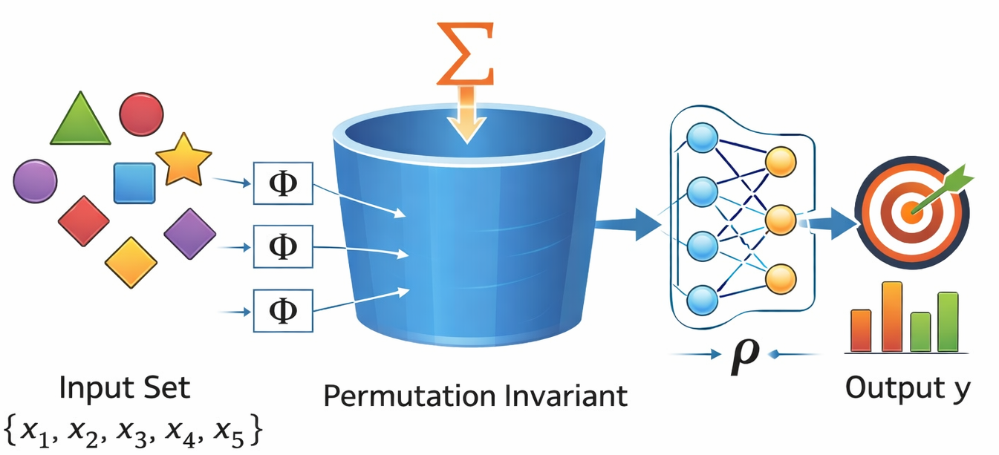

# Deep Sets

The Deep Sets [https://arxiv.org/abs/1703.06114](https://arxiv.org/abs/1703.06114) model handles set-structured data, where the order of elements in the input set does not matter. This is particularly useful for particle physics applications where events can be represented as sets of particles.

Deep Sets model is permutationally invariant to the order of the input features. The model consists of an encoder $\Phi$ that processes each element in the set independently, followed by a pooling operation $\Sigma$ (mean pooling) to aggregate the information from all elements. The aggregated representation is then passed through a decoder MLP to produce the final output $\rho$.

Encoder is implemented as a stack of 1D convolutional layers with kernel size 1, which is equivalent to applying a fully connected layer to each element in the set independently. Each convolutional layer is followed by an activation function, batch normalization (if enabled), and dropout (if specified). After the encoder, mean pooling is applied across the set dimension to obtain a fixed-size representation. This representation is then fed into the decoder MLP.

<figure markdown="span">
  { width="800" }
  <figcaption>Deep Sets architecture with encoder, mean pooling, and decoder.</figcaption>
</figure>

The model can be used for both flat and jagged input features. For flat features, the input is embedded using the flat embedding module and then passed through the deep sets layers. The same applies for jagged features using the jagged embedding module.

For jagged input features, the model handles variable-length sequences through masking using [`scatter_reduce`](https://docs.pytorch.org/docs/stable/generated/torch.scatter_reduce.html) operation to perform mean pooling only over valid (non-padded) elements. Additionally, masking is also performed in jagged embeddings to ensure padded values do not contribute to the embedding output.

## Configuration Options

- `model: DeepSets`: Specifies the model architecture.
- `embedding_dim: int | None`: Dimension of the embedding. If `null`, defaults to the first hidden layer dimension of the model.
- `encoder_layers: int | list][int]`: Number of hidden layers in the encoder MLP. If a list is provided, it specifies the number of units per layer.
- `decoder_layers: int | list[int]`: Number of hidden layers in the decoder MLP. If a list is provided, it specifies the number of units per layer.
- `n_hidden: int | None`: Number of hidden units per layer if `encoder_layers` and `decoder_layers` are specified as integers. If `null`, must provide a list for each.
- `act: str`: Activation function to use.
- `act_out: str | None`: Activation function for the output layer, by default `null`, which means no activation.
- `batchnorm: bool`: Whether to apply batch normalization after each layer, by default `true`.
- `dropout: float`: Dropout rate to apply after each layer, by default `0.0`.
- `mean_pooling: bool`: Whether to use mean pooling before the decoder MLP, by default `true`. If `false` reshapes the output before feeding to MLP.
- `add_particle_types: bool`: Whether to add particle type embeddings to the jagged input features, by default `false`. For jagged model only.
