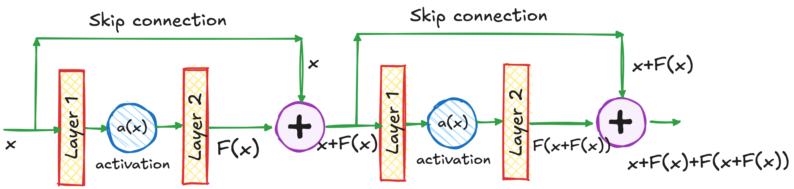

# Feedforward Neural Networks

The simplest architecture in SeeSawML is the feedforward neural network (FNN) also known as multi-layer perceptron (MLP). It consists of multiple fully connected layers with non-linear activation functions in between. A more advanced variant of the MLP is the ResNet (residual) architecture which includes skip connections between layers to improve gradient flow during training.

#### MLP

A standard MLP architecture is composed of a sequence of fully connected layers where each layer takes the output of the previous layer as input, applies a linear transformation followed by a non-linear activation function. Optionally, batch normalization and dropout can be applied after each layer to improve training stability and prevent overfitting.

- `model: MLP`: Specifies the model architecture.
- `n_layers: int`: Number of hidden layers.
- `n_hidden: int`: Number of hidden units per layer.
- `act: str`: Activation function to use.
- `act_out: str | None`: Activation function for the output layer, by default `null`, which means no activation.
- `batchnorm: bool`: Whether to apply batch normalization after each layer, by default `false`.
- `dropout: float`: Dropout rate to apply after each layer, by default `0.0`.

#### ResNet

The ResNet architecture introduces residual (skip) connections that allow the input of a layer to bypass one or more layers and be added to the output. This helps mitigate the vanishing gradient problem and allows for training deeper networks.

<figure markdown="span">
  [{ width="800" }](https://www.vizuaranewsletter.com/p/resnet-the-architecture-that-changed)
  <figcaption>Residual (skip) connections in a ResNet architecture.</figcaption>
</figure>

- `model: ResNet`: Specifies the model architecture.
- `n_layers: int`: Number of hidden layers.
- `n_hidden: int`: Number of hidden units per layer.
- `block_size: int`: Number of layers per residual block, by default `2`.
- `act: str`: Activation function to use.
- `act_out: str | None`: Activation function for the output layer, by default `null`, which means no activation.
- `batchnorm: bool`: Whether to apply batch normalization after each layer, by default `true`.
- `dropout: float`: Dropout rate to apply after each layer, by default `0.1`.

!!! Info "Pre-activation ResNet"
    The code implements a pre-activation ResNet architecture from (described in [https://arxiv.org/abs/1603.05027](https://arxiv.org/abs/1603.05027)) where the activation and normalization layers are applied before the linear layer in each block. This has been shown to improve training stability and performance compared to the original post-activation ResNet design.
