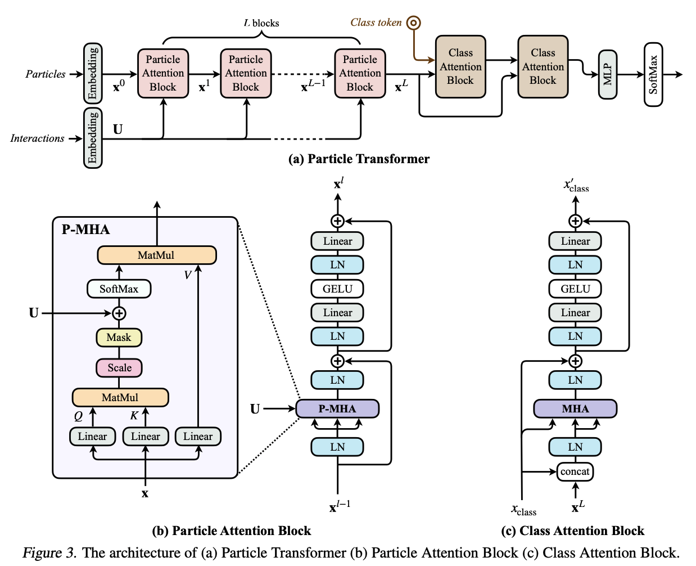

# Transformers

## Feature Tokenizer Transformer

Implementation of [https://arxiv.org/abs/2106.11959](https://arxiv.org/abs/2106.11959) for tabular datasets. The model is used for flat input features only. Each feature is first embedded using the embedding module and then passed through a series of transformer encoder layers. The output of the transformer is then pooled or a cls token is used and passed through a final MLP for classification.

<figure markdown="span">
  [{ width="900" }](https://towardsdatascience.com/improving-tabtransformer-part-1-linear-numerical-embeddings-dbc3be3b5bb5/)
  <figcaption>Feature tokenizer transformer architecture.</figcaption>
</figure>

- `model: EventTransformer`: Specifies the model architecture.
- `embedding_dim: int`: Dimension of the embedding, by default `32`.
- `transformer_depth: int`: Number of transformer encoder layers, by default `6`.
- `heads: int`: Number of attention heads, by default `8`.
- `dim_head: int`: Dimension of each attention head, by default `16`.
- `attn_dropout: float`: Dropout rate for attention weights, by default `0.1`.
- `remove_first_attn_residual: bool`: Whether to remove the residual connection from the first attention layer, by default `false`.
- `remove_first_attn_layernorm: bool`: Whether to remove the layer normalization from the first attention layer, by default `false`.
- `ff_hidden_mult: int`: Multiplier for the hidden dimension of the feedforward layers, by default `4`.
- `ff_dropout: float`: Dropout rate for feedforward layers, by default `0.1`.
- `use_cls_token: bool`: Whether to use a cls token for classification, by default `true`. If `false`, mean pooling is used.

!!! Info "Pre-norm Transformer"

    All the implemented models use pre-norm transformer architecture where layer normalization is applied before the attention and feedforward layers. This has been shown to improve training stability and performance compared to post-norm transformers originally proposed in the "Attention is All You Need" paper.

## Set Transformer

Implementation of Set Transformer model from [https://arxiv.org/abs/1810.00825](https://arxiv.org/abs/1810.00825). The model is used for jagged input features. Each object (e.g. jet, electron, etc.) is first embedded using the jagged embedding module described above and then passed through a series of Set Transformer encoder layers. The output of the transformer is then pooled and passed through a final MLP for classification. The model is permutation invariant to the order of the input objects.

Set transformer aggregates features by applying multihead attention (MHA) on a learnable set of $k$ seed vectors $S \in \mathbb{R}^{k \times d}$. Pooling by Multihead Attention (PMA) with $k$ seed vectors is defined as
$\mathrm{MHA}(S, Z, Z)$, where $Z \in \mathbb{R}^{n \times d}$ is the encoder output. If $k=1$, the output is pooled to a single vector, otherwise the output is of shape $k \times d$.

Set transformer is build with an encoder and a decoder. The encoder, $X \rightarrow Z \in \mathbb{R}^{n \times d}$, consists of multiple attention blocks. After the encoder transforms data $X$ into features $Z$ and PMA performs pooling into representation $P\in \mathbb{R}^{k \times d}$, the decoder aggregates them into a single or a set of vectors which is fed into a feed-forward network to get final output.

The final model can be summarized as (omitting batch dimension):
$$
\mathrm{Encoder}:\quad \mathrm{MHA}(X, X, X) \rightarrow Z \in \mathbb{R}^{n \times d}
$$
$$
\mathrm{Pooling}:\quad \mathrm{PMA}(S, Z, Z) \rightarrow P \in \mathbb{R}^{k \times d}
$$
$$
\mathrm{Decoder}:\quad \mathrm{MHA}(P, P, P) \rightarrow Y \in \mathbb{R}^{k \times d} \text{ if } k>1 \text{ else } Y = P
$$
$$
\mathrm{Reshaping}:\quad Y \rightarrow Y^\prime \in \mathbb{R}^{1\times k \cdot d} (\text{ or pooled } \mathbb{R}^{1\times d}) \text{ if } k>1 \text{ else } Y^\prime = Y
$$
$$
\mathrm{Prediction}:\quad \mathrm{FFN}(Y^\prime) \rightarrow \mathrm{output} \in \mathbb{R}^{1 \times o}
$$

### Configuration Options

- `model: SetTransformer`: Specifies the model architecture.
- `embedding_dim: int`: Dimension of the embedding, by default `64`.
- `heads: int`: Number of attention heads, by default `8`.
- `dim_head: int`: Dimension of each attention head, by default `16`.
- `attn_dropout: float`: Dropout rate for attention weights, by default `0.0`.
- `use_setnorm: bool`: Whether to use set normalization, by default `true`. If `false`, layer normalization is used instead.
- `ff_hidden_mult: int`: Multiplier for the hidden dimension of the feedforward layers, by default `4`.
- `ff_dropout: float`: Dropout rate for feedforward layers, by default `0.0`.
- `seed_strategy: str`: Strategy for selecting number of seed vectors (`pooling`, `particles` or `objects`), by default `pooling`.
- `set_predictor: dict[str | Any]`: Configuration for the final set predictor MLP.
    - `depth: int`: Number of hidden layers.
    - `act`: str`: Activation function to use.
    - `mean_pooling: bool`: Whether to use mean pooling before the MLP, by default `false`. If `false` reshapes the output before feeding to MLP.
- `encoder_depth: int`: Number of encoder layers, by default `2`.
- `decoder_depth: int`: Number of decoder layers, if number of seed vectors is greater than 1, by default `2`.
- `add_particle_types: bool`: Whether to add particle type embeddings to jagged features, by default `false`.
- `first_attn_no_residual: bool`: Whether to remove the residual connection from the first attention layer, by default `false`.

!!! Note "Seed vectors"
    The number of seed vectors $k$ in the implementation depends on the `seed_strategy`:

    - `pooling`: $k=1$ for single output.
    - `particles`: $k$ is set to the maximum number of particles across all objects.
    - `objects`: $k$ is set to the number of objects (e.g., jets, electrons, etc.).

    If $k>1$ a decoder layer is constructed after the encoder using `encoder_depth` that has the same structure as the encoder.

## Particle Transformer

Implementation of particle transformer as described in [https://arxiv.org/abs/2202.03772](https://arxiv.org/abs/2202.03772). The model uses pairwise interactions between particles to capture complex relationships in the data through a modified attention mechanism that incorporates physics-motivated features. The model can also be viewed as a graph neural network on a fully-connected graph, in which each node corresponds to a particle, and the interactions are the edge features.

<figure markdown="span">
  [{ width="800" }](https://arxiv.org/abs/2202.03772)
  <figcaption>Overview of the Particle Transformer model.</figcaption>
</figure>

The Particle Transformer consists of two main stages:

1. **Particle Attention Blocks**: Process all particles (jets and leptons) together using self-attention enhanced with pairwise interaction features. These blocks learn to model relationships between all particles in the event.

2. **Class Attention Blocks**: A learnable CLS token attends to the encoded particle representations to aggregate information for the final classification. This is similar to the CLS token in BERT-like architectures.

### Pairwise Interaction Features

For each pair of particles $i$ and $j$ with 4-momenta $p_i$ and $p_j$, the following physics-inspired pairwise features are computed:

- **$\Delta R$**: Angular separation in the $(\eta, \phi)$ plane:
$$
\Delta R = \sqrt{(\eta_i - \eta_j)^2 + (\phi_i - \phi_j)^2}
$$

- **$k_T$**: Relative transverse momentum (used in jet clustering algorithms):
$$
k_T = \min(p_{\mathrm{T},i}, p_{\mathrm{T},j}) \cdot \Delta R
$$

- **$z$**: Energy sharing fraction:
$$
z = \frac{\min(p_{\mathrm{T},i}, p_{\mathrm{T},j})}{p_{\mathrm{T},i} + p_{\mathrm{T},j}}
$$

- **$m^2$**: Squared invariant mass of the pair:
$$
m^2 =(E_i + E_j)^2 - ||\vec{p}_i + \vec{p}_j||^2
$$

These features are computed for all particle pairs and capture the relative kinematics between particles. Instead of using raw values, the **logarithms** of these features (with appropriate handling of negative/zero values) are passed through a small embedding network to produce pairwise bias terms that are added to the attention scores:

$$\mathrm{Attention}(Q, K, V) = \mathrm{softmax}\left(\frac{QK^\top}{\sqrt{d_k}} + B_{\mathrm{pair}}\right)V$$

where $B_{\mathrm{pair}} \in \mathbb{R}^{N \times N \times H}$ contains the learned pairwise biases for each attention head $H$.

### Configuration Options

- `model: ParticleTransformer`: Specifies the model architecture.
- `embedding_dim: int`: Dimension of the embedding, by default `64`.
- `heads: int`: Number of attention heads, by default `8`.
- `dim_head: int`: Dimension of each attention head, by default `16`.
- `attn_dropout: float`: Dropout rate for attention weights, by default `0.0`.
- `ff_dropout: float`: Dropout rate for feedforward layers, by default `0.0`.
- `ff_hidden_mult: int`: Multiplier for the hidden dimension of the feedforward layers, by default `4`.
- `particle_blocks: int`: Number of particle transformer blocks (stage 1), by default `3`.
- `class_blocks: int`: Number of classification (cls) transformer blocks (stage 2), by default `2`.
- `add_particle_types: bool`: Whether to add particle type embeddings to jagged features, by default `false`.
- `first_attn_no_residual: bool`: Whether to remove the residual connection from the first attention layer, by default `false`.
- `particle_attention: dict[str, Any]`: Configuration for particle attention layers.
    - `embedding_layers: int | list[int]`: Number of hidden layers in the pairwise embedding network. If a list is provided, it specifies the number of units per layer. By default `2`.
    - `embedding_dim: int | None`: Number of hidden units per layer if `embedding_layers` is specified as an integer. If `null`, must provide a list. By default `48`.
    - `objects: list[str] | None`: List of object names to compute pairwise interactions for. If `null`, uses all objects. By default `null`. Possible object names are those defined in the dataset configuration (e.g., `jets`, `electrons`, `muons`).
    - `quantities: list[str] | None`: List of pairwise quantities to compute. If `null`, uses all four quantities (`delta_r`, `kt`, `z`, `m2`). By default `null`.

!!! Note "Computational Considerations"
    Pairwise feature computation scales as $O(N^2)$ where $N$ is the total number of particles per event. For events with many objects (e.g., 20+ jets), this can be memory-intensive.

!!! Warning "Input Preprocessing"
    Pairwise interaction formulas require direct, unscaled input features. Therefore, ensure that these features are not normalized or otherwise transformed in the dataset configuration by setting `numer_scaler_type: null` and `categ_scaler_type: categorical`. The model depends on raw kinematic values to compute pairwise interactions correctly.

    Because SeeSawML applies a global scaling strategy across all features, disabling scaling for the required inputs effectively disables feature scaling for *all* features when using this model. Instead of conventional feature scaling, use piecewise linear embeddings. PLE operates directly on raw feature values and is integrated into the model, making it well suited for handling features with different ranges without compromising the integrity of pairwise computations.

## Scaled Dot-Product Attention

SDP (scaled dot product) attention backends can be used to optimize memory usage and speed of attention computation. Depending on the hardware and input sizes, different backends may provide better performance. It is recommended to experiment with different combinations to find the optimal configuration for a given use case.

Available options are:

- `MATH` is the PyTorch C++ attention implementation.
- `FLASH_ATTENTION` is the attention implementation from the flash attention paper.
- `EFFICIENT_ATTENTION` is the implementation from the facebook xformers library.
- `CUDNN_ATTENTION` is the implementation from the Nvidia CuDNN library.

SDP can be configured in any transformer model configurations under the `architecture_config.sdp_backend` field. For example:

- `sdp_backend: dict[str, bool] | None`: Specifies the backend for scaled dot-product attention, by default `null`.
    - `enable_math: bool`: Whether to enable math kernel, by default `false`.
    - `enable_flash: bool`: Whether to enable flash attention, by default `false`.
    - `enable_mem_efficient: bool`: Whether to enable memory efficient attention, by default `false`.
    - `enable_cudnn: bool`: Whether to enable cuDNN attention, by default `false`.

See [PyTorch documentation](https://docs.pytorch.org/docs/stable/generated/torch.nn.functional.scaled_dot_product_attention.html) for more details.
